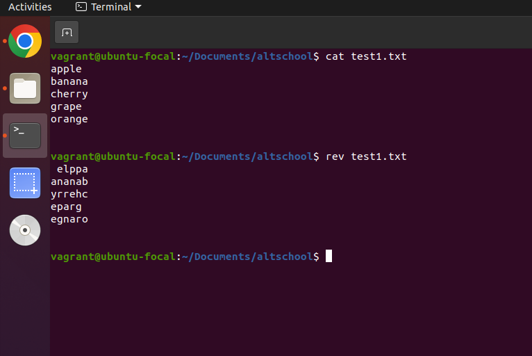

**The 10  Linux Commands**

<!-- shuf (Shuffle Lines of a File) -->
    1. shuf command - Randomizes the order of lines in a file.
 
 - To shuffle the lines, make sure the file is not empty. To see its efficiency, display the original output using cat filename.txt.

 - Then, run the command shuf filename.txt (In my case, I used test.txt as my filename) and hit Enter to see the results.

 

<!-- factor command -->
    2. factor -  is used to display the prime factorization of a given number. It breaks down a number into its prime factors and prints them in ascending order.
 
 - To find the prime factors of a number, simply type factor followed by the number you want to factorize, then hit Enter. It will list the prime factors.
 
 - You can also find the prime factors of multiple numbers. Type factor followed by multiple numbers, e.g., factor 10 55 86 11, and hit Enter.

 

<!-- yes command -->
    3. yes  command- (Spam Output) Repeats a string indefinitely until stopped. 
 - Type yes followed by the string which you want to repeat and hit enter.

 

 

 - To cancel or stop the infinite loop, press Ctrl + C.

 

<!-- look command -->
    4. look - (Word Completion)Find words starting with a specific prefix from the dictionary.
    
 - type look followed by the word (or prefix) you want to search for and hit enter.
    e.g look food

    

<!-- rev command -->
    5. rev - (Reverse Characters in Each Line) Flips the characters in each line of a file.
 
 - To reverse the characters in each line.
 - First, display the original lines to see the changes using cat filename.txt.
 - type rev followed by the filename and hit enter.
    e.g cat filename.txt 

 - type rev filename.txt

     

<!-- file command -->
    6. file - (Detect File Type) Shows the type of a file (text, binary, image, etc.) 
 -To determine the file type, first list the files using the ls command to find the filename you want to check.
 - type file followed by the filename.
 e.g file CV.txt 

 

<!-- cal -y command -->
    7. cal -y - (Full-Year Calendar) Displays the entire year in the terminal.
 - Type cal -y and hit 

 

<!-- tree command -->
    8. tree - The  tree command in Linux displays a hierarchical, tree-like structure of directories and files. It is useful for visualizing folder structures in a terminal.
 - To display a tree like structure of directories and files type tree and hit enter.

 

<!-- curl cheat.sh command -->
    9. curl cheat.sh - (Get Cheat Sheets for Any Command) Displays quick, useful tips for commands like ls, grep, etc.
 - Type curl cheat.sh/ to get quick tips for any Linux command. You also have options to choose from. e.g cheat.sh/ls, cheat.sh --shell and many more.

 

<!--  truncate  command -->
    10. truncate  - Deletes all content inside a text file while keeping the file itself. This command sets the file size to 0 bytes, which empties the file.
 - To see how it works, first display the content of the file using the cat command.
 - Type truncate -s 0 filename.txt to delete all content inside while keeping the file itself.
 
    **Note :** truncate - A command used to shrink or extend the size of a file.
    -s 0 - Sets the file size to 0 bytes (effectively clearing its content).

 - To confirm if the file content is cleared or deleted type cat followed by the filename.
    e.g cat test.txt

 
 
